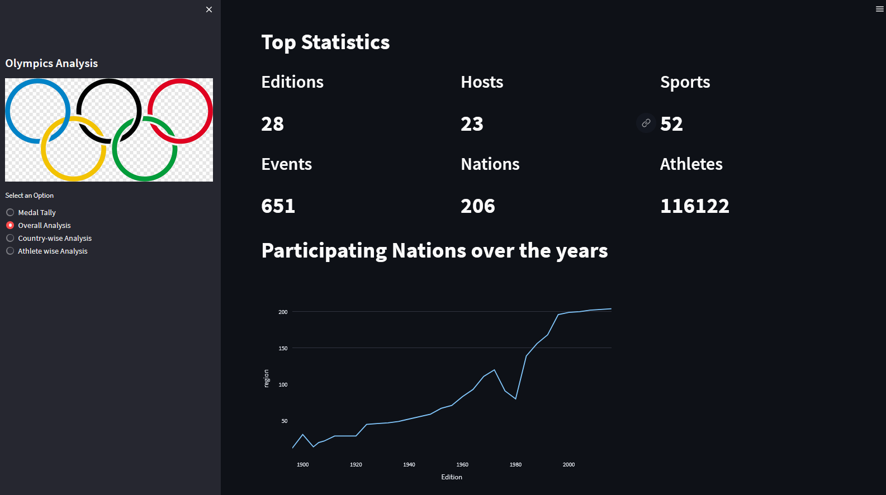

# OlympSis: Your Window to Olympic Insights.

### Explore 120 years of history, athlete triumphs, and medal dynamics with intuitive visualizations. Uncover trends, records, and stories that shape the Olympic legacy.

## :computer: Live

## Watch a live demo here: https://youtu.be/YAkN0LNQots?si=pqSg7lLUyaXdYAQs

## :rocket: Highlights

- **Comprehensive Olympic Exploration:** OlympSis offers an in-depth journey through Olympic history, showcasing hosting nations, athlete achievements, and sport diversity, all in a single platform.

- **Empowering Insights at Your Fingertips:** Gain quick access to valuable insights, whether you're interested in a particular year's performance, a specific country's track record, or a gender-based analysis of medal distributions.

- **Interactive Data Storytelling:** Dive into the narratives behind the numbers with visually appealing dashboards and interactive tools. Uncover stories of triumph, rivalry, and global unity embedded in the legacy of the Olympic Games.

- **Unveiling Trends and Records:** OlympSis goes beyond data representation, enabling you to uncover trends, records, and shifts that have defined the Olympics. Discover how individual athletes and entire nations have left their mark on this global event.

## :zap: Features

- **Medal Tally Insights:** Easily access detailed medal tally information by year, country, and gender. Dive into athlete-specific achievements and country-wise success rates to understand the Olympic performance landscape comprehensively.

- **Historical Analysis:** Explore over 120 years of Olympic history, including hosting nations, total editions, sports, athletes, and events. Gain insights into how the Olympics have evolved over time and their broader societal impact.

- **Diverse Perspectives:** Analyze the Olympics through various lenses, including country-wise, athlete-wise, and gender-wise breakdowns. This comprehensive approach offers a nuanced understanding of the games' dynamics and trends.

- **Rich Visualizations:** Engage with intuitive and impactful visualizations like heat maps, line charts, and interactive maps. These visual aids facilitate swift comprehension of complex data, allowing you to identify patterns, trends, and outliers effortlessly.

##  :open_file_folder: Project Structure

- `OlympSis.py`: Frontend orientation of the application.
- `preprocessor.py`: Preprocesses Excel data for streamlined analysis, ensuring data readiness for insightful interpretation.
- `helper.py`: Encompasses data analysis functions tailored for WhatsApp chat insights.
- `Procfile`: Provides code to run the app in an IDE.
- `requirements.txt`: contains python libraries.
- `setup.sh`: setup file for deployment on Heroku.

## :computer: Tech Stack 

- **Frontend:** Stremlit Framework
- **Backend:** Python
- **Libraries Used:** Matplotlib and Seaborn to Visualize data, numpy, pandas and regex

## :bulb: Future Enhancements

- **Predictive Modeling:** Integrate machine learning models to predict future Olympic trends or outcomes based on historical data patterns.
- **Geospatial Visualization:** Incorporate geospatial visualizations to show the distribution of medals, events, or athletes on a world map.
- **Comparative Analysis:** Enable users to compare performance metrics between different countries, athletes, or time periods.
- **Data Updates:** Regularly update the dataset to include the latest Olympic data and results.
- **Gamification Elements:** Add gamification features like quizzes, challenges, or leaderboards related to Olympic history and trivia.

## :muscle: Contributions

Contributions are welcome! Feel free to open issues for discussion or submit pull requests to enhance the application's functionality and accuracy. Here is how you can contribute.

- **Feature Enhancements:** If you have ideas for new features, improved data visualization, or advanced prediction algorithms, open an issue to discuss your suggestions.

- **Bug Fixes:** If you encounter any bugs or unexpected behavior while using the application, submit detailed bug reports or pull requests to address the issues.

- **Deployment Expertise:** I am seeking help to streamline the deployment process. If you have experience with deploying web applications, your insights would be invaluable in making the application accessible to a wider audience.

To contribute, fork this repository, create a new branch for your work, make your changes, and submit a pull request. Let's collaborate to make this application even more powerful and user-friendly!

## :page_facing_up: License

This project is licensed under the [MIT License](LICENSE).

Built with :heart: by Arunim Malviya
